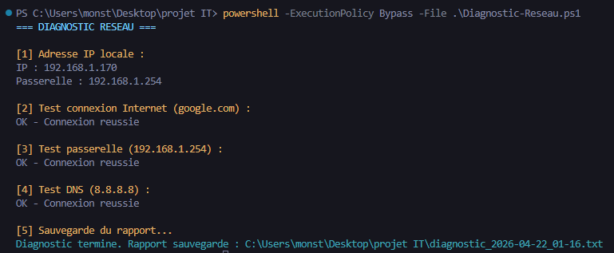

# Network Diagnostic Tool (PowerShell)

Outil professionnel de diagnostic réseau Windows pour environnement support IT / GMSI, avec une progression orientée ASR.

Le script principal reste:

```powershell
.\Diagnostic-Reseau.ps1
```

Il produit une vue terminal technicien + des rapports structurés exploitables.

## Objectifs
- Centraliser les diagnostics réseau dans un seul run.
- Réutiliser les mêmes résultats pour le terminal, TXT, JSON et dashboard HTML.
- Diagnostiquer les couches essentielles: connectivité, DHCP, DNS, routage, ports TCP, Wi-Fi, charge contrôlée, débit.
- Fournir une analyse automatique avec recommandations support.

## Fonctionnalités actuelles
- Collecte configuration IPv4 active (IP, masque, passerelle, DNS, interface, MAC, DHCP, vitesse lien).
- Tests de connectivité (Internet, passerelle, DNS).
- Diagnostic DHCP avancé (serveur, bail, détection APIPA).
- Diagnostic DNS avancé (résolution multi-domaines, latence par domaine, erreurs détaillées).
- Diagnostic routage (route par défaut, passerelle joignable, extrait traceroute).
- Tests TCP ciblés (80/443/445/3389 par défaut, cible configurable, timeout configurable).
- Diagnostic Wi-Fi (interface, SSID, signal, canal, débit RX/TX, scan optionnel).
- Test de charge réseau contrôlé (before / under / after avec delta de latence et pertes).
- Test de débit descendant optionnel (mesure réelle basée sur téléchargement chronométré).
- Analyse automatique + score réseau.
- Rapports TXT, JSON et dashboard HTML local.

## Prérequis
- Windows 10/11
- PowerShell 5.1+
- Accès réseau selon les cibles testées
- Droits standard (admin non obligatoire pour le mode de base)

## Utilisation

### Exécution standard
```powershell
powershell -ExecutionPolicy Bypass -File .\Diagnostic-Reseau.ps1
```

### Exemple avec options
```powershell
.\Diagnostic-Reseau.ps1 `
  -DnsServer "8.8.8.8" `
  -DnsTestDomains "google.com","github.com" `
  -TcpTarget "google.com" `
  -TcpPorts 80,443,445,3389 `
  -LoadTestTarget "cloudflare.com" `
  -LoadTestMonitorTarget "8.8.8.8" `
  -LoadTestDurationSec 6 `
  -EnableBandwidthTest `
  -OpenDashboard
```

## Paramètres principaux
- `DnsServer`: cible de test DNS ping.
- `DnsTestDomains`: domaines testés en résolution DNS.
- `RoutingTraceTarget`: cible traceroute.
- `TraceMaxHops`: limite de sauts traceroute.
- `TcpTarget`: hôte cible pour tests ports TCP.
- `TcpPorts`: liste de ports TCP autorisés explicitement.
- `TcpTimeoutMs`: timeout par tentative TCP.
- `IncludeWifiScan`: active le scan nearby Wi-Fi.
- `LoadTestTarget`: cible génératrice de charge contrôlée.
- `LoadTestMonitorTarget`: cible mesurée pour latence/pertes.
- `LoadTestSampleCount`, `LoadTestDurationSec`, `LoadTestParallelStreams`: contrôle du test de charge.
- `EnableBandwidthTest`: active la mesure de débit.
- `BandwidthTestUrl`, `BandwidthTimeoutSec`: contrôle du test de débit.
- `GenerateDashboard`: active la génération HTML.
- `OpenDashboard`: ouvre automatiquement le dashboard.

## Rapports générés
Le script génère des fichiers horodatés:
- `diagnostic_yyyy-MM-dd_HH-mm.txt`
- `diagnostic_yyyy-MM-dd_HH-mm.json`
- `diagnostic_yyyy-MM-dd_HH-mm.html`

Le JSON est la source structurée principale pour les futures évolutions.

## Architecture logique
```text
Diagnostic-Reseau.ps1
  -> Collecte diagnostics
  -> Resultats structures
  -> Analyse + score
  -> Affichage terminal
  -> Export TXT / JSON / HTML
```

## Sécurité et limites
- Aucun scan agressif.
- Test de charge limité et contrôlé.
- Pas de secrets stockés.
- Les résultats dépendent de la connectivité réelle, des firewalls et des politiques réseau.

## Roadmap (prochaines étapes)
- Modularisation progressive en modules PowerShell (`Modules/`).
- Dashboard HTML enrichi (KPI/graphes supplémentaires).
- Tests automatisés Pester.
- Documentation d’exploitation et troubleshooting avancé.

## Exemple

